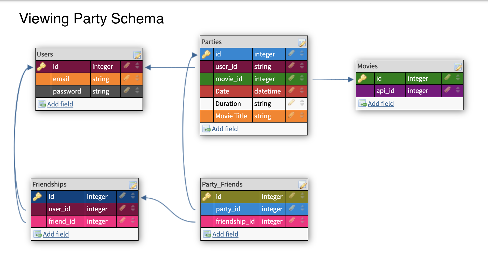

# Viewing Party
*Virtual Viewing, made easy. Add friends, create parties, invite your friends to the parties!*

## About this Project
Viewing Party is a User web application for creating and tracking movie viewing parties. Users can register for an account with an email and password. This application interacts with the [MovieDataBase](https://www.themoviedb.org/?language=en-US) API so movie information is always up to date. Add friends to your profile via email. Find the top rated movies or search for your favorite movie by title, if you want to watch it - you can! Once the perfect movie is selected you can create a viewing party and selectively invite your friends!

## Summary

  - [Getting Started](#getting-started)
  - [Runing the tests](#running-the-tests)
  - [Deployment](#deployment)
  - [Built With](#built-with)
  - [Contributing](#contributing)
  - [Versioning](#versioning)
  - [Authors](#authors)
  - [License](#license)
  - [Acknowledgments](#acknowledgments)

## Getting Started

To get the web application running, please fork and clone down the repo.
`git clone <your@github.account/viewing_party>`

### Prerequisites

To run this application you will need Ruby 2.5.3 and Rails 5.2.4.3

### Installing

- Install the gems  
`bundle install`

- Create the database  
`rails db{:drop, :create, :migrate}`

- Create local environmental variables  
  If `config/application.yaml` does not exist, install Figaro from the command line  
  `bundle exec figaro install`  
  This command will create the file and add it to .gitignore

- Add your API key and the below variables
  ```yaml
  #config/application.yaml
  API_KEY: <your_tmdb_api_key_here>
  API_TEST_COUNT_URL: "https://api.themoviedb.org/3/discover/movie?api_key=<YOUR_TMBD_API_KEY_HERE>&language=en-US&sort_by=vote_average.desc&include_adult=false&include_video=false&page=1"
  SEARCH_RESULT_COUNT: "40"
  ```
  Please visit The MovieDataBase to get an API key. The SEARCH_RESULT_COUNT variable is to specify how many search results to return when a movie is searched by title. To allow for dynamic code and changes to be made without having to change application code.

## Running the tests
RSpec testing suite is utilized for testing this application. Please note webmock, figaro, and VCR are utilized.
- Run the RSpec suit to ensure everything is passing as expected  
`bundle exec rspec`

## Database Schema
The schema represents the relationships between the models in the database.
  - A User can have many friends and parties.
  - A Party can have 1 host and many invitees.
  - A Party can have 1 movie and 1 host and many invitees.



#### Debugging tests
Please note, you may need to delete `spec/fixtures/vcr_cassettees` to get tests working.

## Deployment

Travis CI was utilized for deployment on this project. Please note this project was developed during the licensing issues with `mimemagic` that persisted on the week of March 29, 2021. Adjustments were made, but as the licensing issues develops changes to gems might need to be implements.

To deploy this application please utilize your own hosting service. The original repo is deployed to Heroku-18.

## Applicaiton code

```

```

## Authors

- **Joseph Budina**
     | [GitHub](https://github.com/josephbudina) |
    [LinkedIn](https://www.linkedin.com/in/joseph-budina-7a0bb4202/)
- **Katy La Tour**
     | [GitHub](https://github.com/klatour324) |
    [LinkedIn](https://www.linkedin.com/in/klatour324/)
- **Alexa Morales Smyth**
     | [GitHub](https://github.com/amsmyth1) |
    [LinkedIn](https://linkedin.com/alexamorales)

# DTR
https://gist.github.com/klatour324/e4b8e3181a80421ab633654dc64134b7
