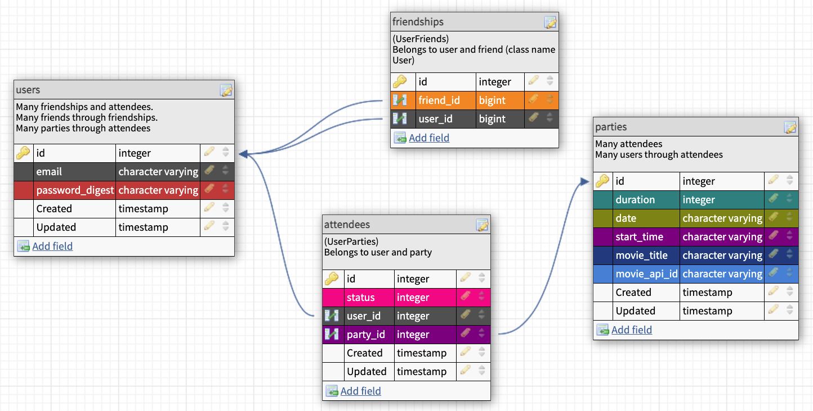

# Viewing Party

## About this Project
Welcome to Viewing Party, a fun social platform where you can create a virtual movie watch party and invite your friends. Grab some popcorn and enjoy the show!

## Table of Contents

  - [Getting Started](#getting-started)
  - [Running the tests](#running-the-tests)
  - [DB Schema](#db-schema)
  - [Endpoints](#endpoints)
  - [Built With](#built-with)
  - [Versioning](#versioning)
  - [Authors](#authors)

## Getting Started

This app has been deployed to Heroku and can be found [here](https://nameless-lowlands-35724.herokuapp.com/)

To run the web application on your local machine, you can fork and clone down the repo and follow the installation instructions below.

### Installing

- Install the gem packages  
`bundle install`

- Create the database by running the following command in your terminal
`rails db{:drop, :create, :migrate}`

### Prerequisites

To run this application you will need Ruby 2.5.3 and Rails 5.2.5

## Running the tests
RSpec testing suite is utilized for testing this application.
- Run the RSpec suite to ensure everything is passing as expected  
`bundle exec rspec`

## DB Schema
The following is a depiction of our Database Schema

 

## API Endpoints Consumed

This application uses data from [The Movie Database API](https://developers.themoviedb.org/3/getting-started/introduction)

## Built With
- Ruby
- Rails
- RSpec

## Gems Used
- Faraday
- Bcrypt
- Figaro
- Travis
- Rubocop
- Webmock
- VCR

## Versioning
- Ruby 2.5.3
- Rails 5.2.5

## Authors
- **Diana Buffone**
| [GitHub](https://github.com/Diana20920) |
  [LinkedIn](https://www.linkedin.com/in/dianabuffone/)
- **Gaelyn Cooper**
| [GitHub](https://github.com/gaelyn) |
  [LinkedIn](https://www.linkedin.com/in/gaelyn-cooper/)
