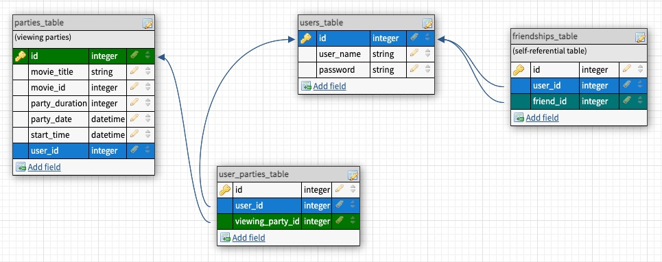

## Table of contents
[**General Info**](#general-info) |
[**Link**](#link) |
[**Database Schema**](#database-schema) |
[**Areas of Focus**](#areas-of-focus) |
[**Technologies**](#technologies) |
[**Setup**](#setup) |
[**Features**](#features) |
[**Status**](#status) | 
[**Contact**](contact)

## General info
Viewing party is an application in which users can explore movies and create a viewing party event for the user and their friends.

### Features:
  * User authentication and log in with email and password
  * Ability to search and add friends
  * Discover popular movies or locate by title search
  * View search results and movie details such as average rating, cast, reviews
  * Create viewing party events with friends
  * User dashboard displays information on friends and viewing parties, including host status

  

## Link
### [https://joe-joey-viewing-party.herokuapp.com/](https://joe-joey-viewing-party.herokuapp.com/)

## Database Schema

## Areas of Focus
* Consume JSON APIs that require authentication
* Build application with basic user authentication
* Organize and refactor code, including using POROs and Facades
* Implement a self-referential relationship in ActiveRecord
* Apply RuboCop style guide for consistent code style
* Utilize Continuous Integration using Travis CI
* Deploy app to Heroku

## Technologies
Project is created with:
* Ruby version 2.5.3
* Rails version 5.2.5

## Setup
To run this program:

1. Open the browser of your choice and navigate to:
[https://joe-joey-viewing-party.herokuapp.com/](https://joe-joey-viewing-party.herokuapp.com/)
2. Register as a new user with email address and password
3. Search or 'Discover' movies and create new viewing parties from a movie's detail page

   ## Local Setup

   1. Fork and Clone the repo
   2. Install gem packages: `bundle install`
   3. Setup the database: `rails db:create`

## To-do list:
* Add links to movie titles on User's Dashboard - Parties section
* Refactoring
* Add movie poster images from API
* Additional API consumption
* Front-End styling
* Validate email address format for user registration

## Status
Project is: _in progress_

## Contact
Created by
* Joey Hass [GitHub](https://github.com/joeyh92989) • [LinkedIn](https://www.linkedin.com/in/haasjoseph/)
* Joe Mecha [GitHub](https://github.com/joemecha) • [LinkedIn](https://www.linkedin.com/in/joemecha/)

~ feel free to contact us ~

