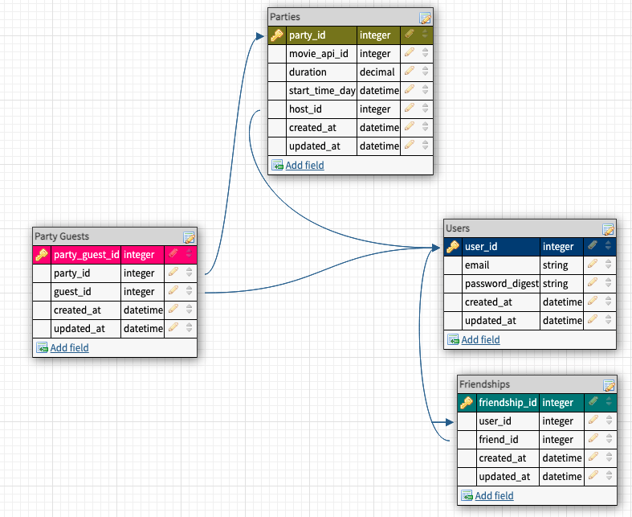

# Project: Viewing Party
## Group Member Names: Kevin & Suzie

This is the base repo for the [viewing party project](https://backend.turing.io/module3/projects/viewing_party) used for Turing's Backend Module 3.

### About this Project

Viewing party is an application in which users can explore movie options and create a viewing party event for the user and friend's. This is our alpha version and was built over the course of eight days. 

## Local Setup

1. Fork and Clone the repo
2. Install gem packages: `bundle install`
3. Setup the database: `rails db:create`

## How To Use It 
If this is your first time using the app: 
1. Register with your email and password 
2. Log in on the welcome page 

To Add Friends: 
1. Enter the email of your friend under Friends heading
2. Click `Add Friend` button
3. You can only add one friend at a time. Repeat step 1 and 2 for additional friends. 

To Discover Movies: 
1. Click on the `Discover Movies` button on your user dashboard 
2. Click `Find Top Rated Movies` to see the 40 top rated movies by vote average 
3. Enter a search query to filter movies by title and click `Search` 

To Create Viewing Party
(You must add friends before creating a viewing party)
1. Click on movie title from the movies list
2. Click `Create Viewing Party` button on Movie detail page
3. Enter duration, the date and the starttime 
4. Check box for each invited friend 
5. Click `Create Party` button 

## Versions

- Ruby 2.7.2

- Rails 5.2.5

### Schema 

## Future Iterations 
[] Add edit functionality to viewing parties 
[] Add edit functionality to friends list 
[] Consume additional API endpoints from The MovieDB API

